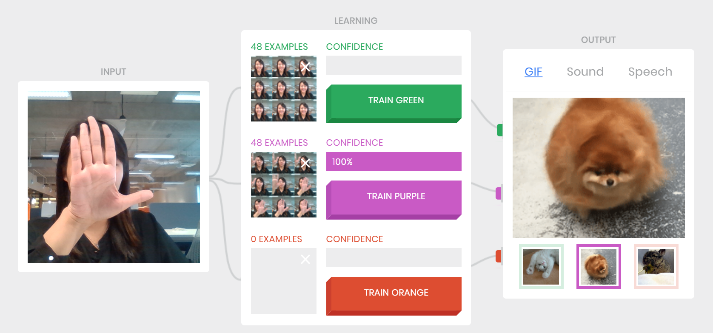
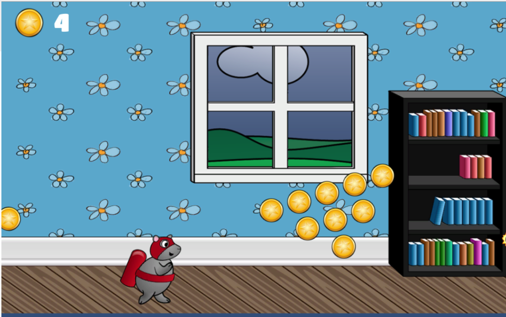
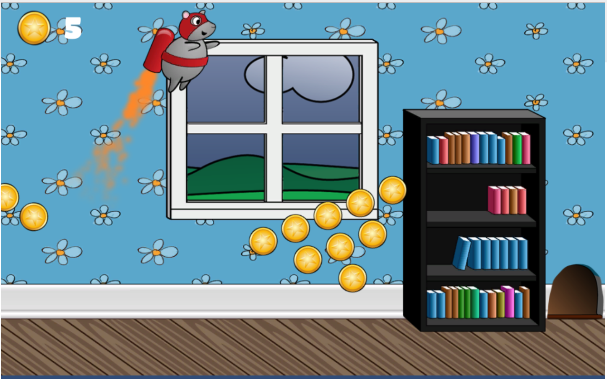

# Touchless Rocket Mouse
## About
An innovative touchless game experience where the user can train the computer (Machine Learning) to recognize gestures, poses and facial expressions, that correspond to game controls (in this case, "fly"). This is an integration of the objection detection api using Google AI experiment, Teachable Machine, and a Rocket Mouse game in WebGL format. A separate [Backend server](https://github.com/aigamesyoozoo/TouchlessGameBackend.git) runs concurrently to facilitate data transfer between the AI model and game. 

## Credits
Objection detection
* Google AI experiment, Teachable Machine - [Link to repository](https://github.com/googlecreativelab/teachable-machine.git)

Game
* raywenerlich's Rocket Mouse tutorial - [Link to tutorial](https://www.raywenderlich.com/5458-how-to-make-a-game-like-jetpack-joyride-in-unity-2d-part-1)







## How to play
* Clone this Touchless Game repo and the repo for the [Backend server](https://github.com/aigamesyoozoo/TouchlessGameBackend.git)
* Each repo concurrently runs on separate localhost ports
  * Touchless Game: port 3000
  * Backend server: port 4000
* Train two gestures/images
  * first for idle mouse
  * second for flying mouse
* Scroll down to the game
  * Click on Settings > change the IP address to your IP address (In command prompt type: ipconfig)
  * Click on Start Game

## How to run this project?
#### Install dependencies by running (similar to `npm install`)
```
yarn
```

#### Build project
```
yarn build
```

#### Start local server by running 
```
yarn run watch
```
* Important! Change the url from IP address to localhost as there are security restrictions on webcam use when using IP as server in url.
